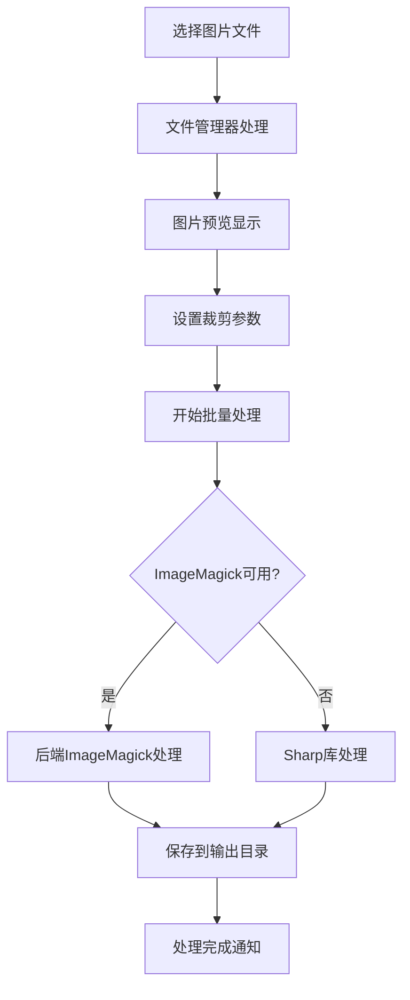

# imgBatchClipper

✂️ 专业的图片批量裁剪工具，基于 Electron + Vue.js 开发，提供可视化的图片裁剪体验。

## ✨ 核心功能

### 🎯 智能批量处理
- **多文件选择**: 一次选择多张图片，批量处理提升效率
- **格式兼容**: 支持 JPG、PNG、GIF、BMP、TIFF 等主流图片格式
- **进度跟踪**: 实时显示处理进度和状态信息

### 🖱️ 可视化裁剪操作
- **拖拽选区**: 在预览区域直接拖拽创建裁剪区域
- **区域移动**: 在裁剪区域内部拖拽移动选区位置
- **边缘调整**: 拖拽裁剪区域边缘调整大小
- **精确参数**: 手动输入精确的 X、Y、宽度、高度数值

### 🔍 图片预览控制
- **缩放控制**: 放大/缩小图片以精确定位裁剪区域
- **适应窗口**: 一键调整图片大小适应预览窗口
- **实时覆盖**: 裁剪区域实时显示在图片预览上

### ⚡ 高性能处理
- **ImageMagick**: 优先使用原生 ImageMagick 获得最佳性能
- **Sharp 备用**: JavaScript Sharp 库作为备用处理方案
- **异步处理**: 批量操作不阻塞用户界面

## 🏗️ 技术架构

### 前端技术栈
- **Electron 15+**: 跨平台桌面应用框架
- **Vue.js 3**: 响应式用户界面构建
- **模块化设计**: 功能分离，易于维护扩展
- **原生体验**: 流畅的桌面应用交互

### 后端处理
- **ImageMagick**: 命令行图片处理引擎（推荐）
- **Sharp**: Node.js 图片处理库（备用）
- **IPC 通信**: 主进程与渲染进程高效通信
- **文件系统**: Node.js 原生文件操作

### 界面布局
```
┌─────────────────────────────────────────────────────────┐
│  ✂️ imgBatchClipper                                     │
├─────────────┬─────────────────────────┬─────────────────┤
│  📁 文件列表  │     🖼️ 图片预览区域      │  ⚙️ 参数设置     │
│             │                        │                │
│ • 图片1.jpg  │   [图片预览 + 裁剪框]    │  X: 100        │
│ • 图片2.png  │                        │  Y: 100        │
│ • 图片3.gif  │   🔍 缩放控制           │  宽度: 200      │
│             │                        │  高度: 150      │
│ 🗑️ 清空     │   📐 裁剪区域            │  📁 输出设置     │
│             │                        │  ✂️ 开始裁剪     │
└─────────────┴─────────────────────────┴─────────────────┘
```

## 🚀 快速开始

### 环境准备
```bash
# 必需环境
Node.js 16+
npm 或 yarn

# 推荐安装 ImageMagick（提升性能）
# macOS: brew install imagemagick
# Ubuntu: sudo apt-get install imagemagick
# Windows: 下载官方安装包
```

### 安装运行
```bash
# 1. 安装依赖
npm install

# 2. 启动应用
npm start

# 或使用启动脚本
./start.sh
```

## 📖 使用指南

### 基本工作流程
1. **📁 选择图片**: 点击"选择图片文件"，支持多选
2. **🖼️ 预览切换**: 在左侧文件列表中切换预览不同图片
3. **✂️ 设置裁剪**: 
   - 方式一：在预览区域拖拽选择裁剪区域
   - 方式二：在右侧面板手动输入精确参数
4. **⚙️ 输出配置**: 设置输出文件名后缀
5. **🚀 批量处理**: 点击"开始批量裁剪"执行处理

### 高级交互技巧
- **创建选区**: 在裁剪区域外拖拽创建新的裁剪区域
- **移动选区**: 在裁剪区域内部拖拽移动整个选区
- **调整大小**: 拖拽裁剪区域边缘调整选区尺寸
- **缩放预览**: 使用 +/- 按钮或滚轮缩放图片预览
- **重置操作**: 使用重置按钮快速恢复默认设置

### 快捷键操作
| 快捷键 | 功能 |
|--------|------|
| `Ctrl/Cmd + O` | 打开文件选择对话框 |
| `Ctrl/Cmd + Enter` | 开始批量裁剪 |
| `Ctrl/Cmd + Delete` | 清空所有文件 |
| `方向键` | 移动裁剪区域（1像素） |
| `Shift + 方向键` | 移动裁剪区域（10像素） |

## 📂 输出说明

### 输出位置
```
~/Pictures/imgBatchClipper_Output/
```

### 文件命名规则
```
原文件名 + 输出后缀 + 原扩展名
例如: photo.jpg + _cropped → photo_cropped.jpg
```

### 处理引擎选择
```
优先级: ImageMagick > Sharp
• ImageMagick: 原生命令行工具，性能最佳
• Sharp: JavaScript 库，兼容性好
```

## 🔧 模块架构

项目采用模块化设计，各模块职责清晰：

- **`cropCalculator.js`**: 裁剪计算逻辑（坐标转换、边界约束）
- **`imageDisplayManager.js`**: 图片显示管理（缩放、尺寸计算）
- **`cropInteractionHandler.js`**: 交互处理（拖拽、调整、移动）
- **`fileManager.js`**: 文件管理（选择、列表、信息获取）
- **`imageProcessor.js`**: 后端图片处理（裁剪、批量操作）

### 处理流程


## 🐛 故障排除

### 常见问题
| 问题 | 解决方案 |
|------|----------|
| 无法启动应用 | 检查 Node.js 版本，重新 `npm install` |
| 图片处理缓慢 | 安装 ImageMagick 以获得最佳性能 |
| 大文件处理失败 | 程序自动选择合适的处理方式，请耐心等待 |
| 裁剪区域不显示 | 确保图片已加载完成，尝试切换其他图片 |
| `@electron/remote` 错误 | 依赖已自动配置，重启应用即可 |
| 无法复制界面文字 | 已启用文本选择功能，直接选择复制 |

### 调试模式
```bash
# 开启详细日志
DEBUG=true npm start

# 开发模式（自动打开开发者工具）
npm run dev
```

### 性能优化建议
- **安装 ImageMagick**: 获得最佳图片处理性能
- **内存管理**: 处理大量图片时，程序自动管理内存使用
- **批量大小**: 建议单次处理不超过 100 张图片
- **图片格式**: PNG 格式处理时间较长，JPG 格式最快

## 📄 许可证

MIT License - 自由使用，欢迎贡献代码改进项目。

## 🤝 贡献指南

欢迎提交 Issue 和 Pull Request 来改进项目：
- 🐛 Bug 报告：请提供详细的复现步骤
- 💡 功能建议：描述使用场景和预期效果
- 🔧 代码贡献：遵循现有代码风格，添加必要测试

## 🚀 开源说明

### 开源协议
本项目采用 MIT 开源协议，可自由使用、修改和分发。

### 核心依赖库
| 库名称 | 用途 | 版本 |
|--------|------|------|
| **Electron** | 跨平台桌面应用框架 | ^27.0.0 |
| **Vue.js** | 响应式前端框架 | ^3.3.4 |
| **ImageMagick** | 高性能图片处理引擎 | ^0.1.3 |
| **Sharp** | Node.js 图片处理库（备用） | ^0.32.6 |
| **Canvas** | 前端图片处理 | ^2.11.2 |

### 贡献指南
- 🐛 **Bug 反馈**: 提交详细的问题描述和复现步骤
- 💡 **功能建议**: 描述使用场景和预期效果  
- 🔧 **代码贡献**: Fork 项目，提交 Pull Request

### 技术栈选择
- **为什么选择 Electron**: 跨平台一致性，快速开发
- **为什么选择 Vue.js**: 轻量级，学习成本低
- **为什么选择 ImageMagick**: 处理速度快，支持格式全

---

**开发理念**: 简单易用的界面设计 + 强大的批量处理能力 = 高效的图片裁剪工具